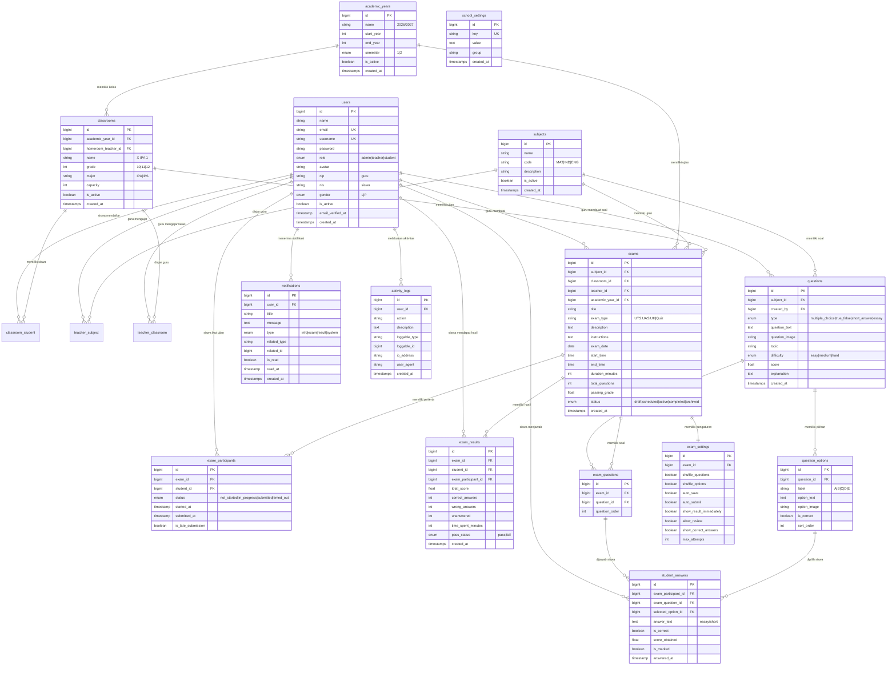

# 📐 Rancangan Database EduExam

> **Platform Ujian Digital Sekolah**
> Mencakup Stage 1 (Siswa), Stage 2 (Guru), Stage 3 (Administrator)

---

## 📊 Entity Relationship Diagram



---

## 📋 Daftar Tabel & Penjelasan

### Kelompok 1: Pengguna & Autentikasi

| Tabel | Fungsi |
|-------|--------|
| `users` | Tabel utama semua pengguna (admin, guru, siswa) dengan role-based access |
| `password_reset_tokens` | Token reset password (bawaan Laravel) |
| `sessions` | Sesi login aktif (bawaan Laravel) |

### Kelompok 2: Struktur Sekolah

| Tabel | Fungsi |
|-------|--------|
| `academic_years` | Tahun ajaran & semester |
| `subjects` | Daftar mata pelajaran |
| `classrooms` | Daftar kelas per tahun ajaran |
| `classroom_student` | Pivot: siswa ↔ kelas |
| `teacher_subject` | Pivot: guru ↔ mata pelajaran |
| `teacher_classroom` | Pivot: guru ↔ kelas |

### Kelompok 3: Bank Soal

| Tabel | Fungsi |
|-------|--------|
| `questions` | Soal-soal (PG, B/S, Isian, Essay) |
| `question_options` | Pilihan jawaban untuk soal pilihan ganda |

### Kelompok 4: Ujian

| Tabel | Fungsi |
|-------|--------|
| `exams` | Ujian yang dibuat guru |
| `exam_settings` | Pengaturan per ujian (acak soal, auto-submit, dll) |
| `exam_questions` | Pivot: soal yang dipakai di ujian |
| `exam_participants` | Peserta ujian & status pengerjaan |
| `student_answers` | Jawaban per soal per siswa |
| `exam_results` | Ringkasan hasil ujian per siswa |

### Kelompok 5: Sistem

| Tabel | Fungsi |
|-------|--------|
| `notifications` | Notifikasi untuk semua pengguna |
| `activity_logs` | Log aktivitas sistem (audit trail) |
| `school_settings` | Pengaturan sekolah (key-value) |

---

## 🔗 Relasi Antar Tabel

### Relasi Utama

| Dari | Ke | Tipe | Keterangan |
|------|-----|------|-----------|
| `users` (student) | `classrooms` | Many-to-Many | via `classroom_student` |
| `users` (teacher) | `subjects` | Many-to-Many | via `teacher_subject` |
| `users` (teacher) | `classrooms` | Many-to-Many | via `teacher_classroom` |
| `classrooms` | `academic_years` | Many-to-One | Kelas punya 1 tahun ajaran |
| `classrooms` | `users` (teacher) | Many-to-One | Wali kelas |
| `questions` | `subjects` | Many-to-One | Soal milik 1 mapel |
| `questions` | `users` (teacher) | Many-to-One | Dibuat oleh guru |
| `questions` | `question_options` | One-to-Many | 1 soal punya banyak pilihan |
| `exams` | `subjects` | Many-to-One | Ujian untuk 1 mapel |
| `exams` | `classrooms` | Many-to-One | Ujian untuk 1 kelas |
| `exams` | `users` (teacher) | Many-to-One | Dibuat oleh guru |
| `exams` | `questions` | Many-to-Many | via `exam_questions` |
| `exams` | `users` (student) | Many-to-Many | via `exam_participants` |
| `exam_participants` | `student_answers` | One-to-Many | 1 partisipasi punya banyak jawaban |
| `student_answers` | `exam_questions` | Many-to-One | Jawaban untuk soal spesifik |
| `student_answers` | `question_options` | Many-to-One | Pilihan yang dipilih |
| `exam_results` | `exams` | Many-to-One | Hasil untuk 1 ujian |
| `exam_results` | `users` | Many-to-One | Hasil milik 1 siswa |

---

## 🛡️ Indeks & Constraint

### Indeks Penting

| Tabel | Kolom | Tipe |
|-------|-------|------|
| `users` | `email` | UNIQUE |
| `users` | `username` | UNIQUE |
| `users` | `role` | INDEX |
| `users` | `nis` | INDEX |
| `users` | `nip` | INDEX |
| `questions` | `subject_id` | INDEX |
| `questions` | `created_by` | INDEX |
| `questions` | `type` | INDEX |
| `questions` | `difficulty` | INDEX |
| `exams` | `status` | INDEX |
| `exams` | `exam_date` | INDEX |
| `exams` | `teacher_id, subject_id` | COMPOSITE |
| `exam_participants` | `exam_id, student_id` | UNIQUE COMPOSITE |
| `student_answers` | `exam_participant_id, exam_question_id` | UNIQUE COMPOSITE |
| `exam_results` | `exam_id, student_id` | UNIQUE COMPOSITE |
| `notifications` | `user_id, is_read` | COMPOSITE |
| `activity_logs` | `user_id, created_at` | COMPOSITE |

### Foreign Key Cascades

| FK | ON DELETE |
|----|-----------|
| `classroom_student.student_id → users.id` | CASCADE |
| `classroom_student.classroom_id → classrooms.id` | CASCADE |
| `question_options.question_id → questions.id` | CASCADE |
| `exam_questions.exam_id → exams.id` | CASCADE |
| `exam_questions.question_id → questions.id` | CASCADE |
| `student_answers.exam_participant_id → exam_participants.id` | CASCADE |
| `exam_results.exam_id → exams.id` | CASCADE |
| `notifications.user_id → users.id` | CASCADE |
| `activity_logs.user_id → users.id` | SET NULL |

---

## 📌 Alur Data per Stage

### Stage 1 — Siswa

```
users (role=student)
  → classroom_student → classrooms
  → exam_participants → exams
  → student_answers → exam_questions → questions → question_options
  → exam_results
  → notifications
```

### Stage 2 — Guru

```
users (role=teacher)
  → teacher_subject → subjects
  → teacher_classroom → classrooms
  → questions → question_options
  → exams → exam_questions → questions
  → exams → exam_participants → student_answers
  → exams → exam_results (view results, analytics)
  → activity_logs
```

### Stage 3 — Admin

```
users (role=admin)
  → users (CRUD semua user)
  → classrooms (CRUD)
  → subjects (CRUD)
  → academic_years (CRUD)
  → exams (view all, archive)
  → school_settings (configure)
  → activity_logs (audit)
  → notifications (system-wide)
```

---

> [!IMPORTANT]
> Klik **Proceed** untuk melanjutkan pembuatan semua file Laravel Migration berdasarkan rancangan ini.
